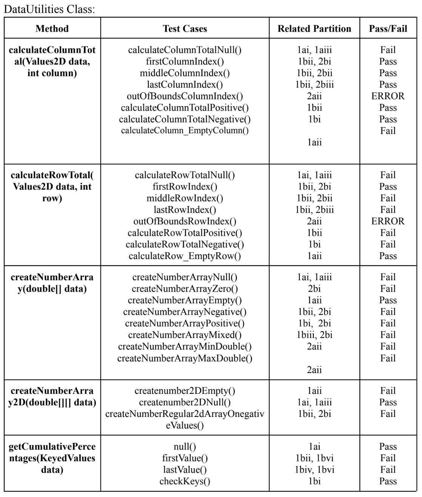
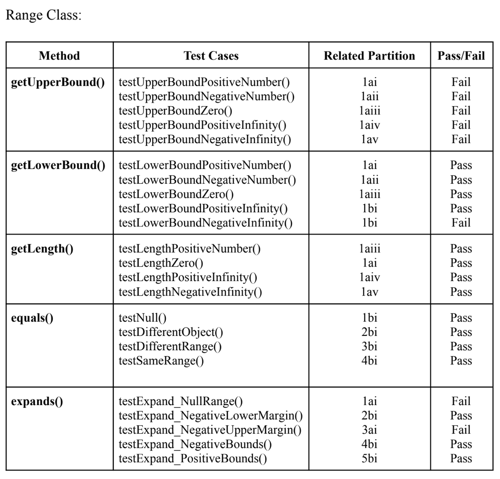

**SENG 438 - Software Testing, Reliability, and Quality**

**Lab. Report \#2 – Requirements-Based Test Generation**

| Group: 3                  |
|---------------------------|
| Student 1 Ahmed Abbas     |   
| Student 2 Rimal Rizvi     |   
| Student 3 Mariyah Malik   |   
| Student 4 Macayla Konig   |   

# 1 Introduction
In this lab assignment, our main goal is to explore the fundamentals of automated unit testing, with a specific focus on crafting tests tailored to the distinct requirements of each unit. JUnit, an integral part of the XUnit framework family and a widely used unit testing framework for Java, takes center stage as our primary tool. By the end of this lab, we aim to empower ourselves to create automated test code proficiently using JUnit and other XUnit frameworks, such as NUnit. Additionally, we will learn to seamlessly integrate and work with mock objects in the development of our test code.

It's important to note that this lab is a collaborative effort, meant to be completed as a group. Together, we will navigate through three key sections. The initial phase is designed to familiarize ourselves with the essential concepts. We'll then transition to the creation of unit tests based on the requirements outlined in Javadocs. Finally, the testing journey concludes with the execution of the test suites on various versions of the system under scrutiny, with a meticulous collection of the results.

The tools at our disposal for this lab are JUnit and Javadoc. JUnit, being a popular and free unit testing tool for Java, provides a robust framework for our testing endeavors. Javadoc, on the other hand, serves as the format for storing requirement specifications, aiding in the generation of comprehensive test suites.

# 2 Detailed description of unit test strategy

The unit test strategy for this lab is to develop a comprehensive suite of tests that cover all the requirements outlined in the Javadoc. The strategy is to create a test suite for each method in the source code, with each test suite containing test cases that cover all the partitions identified in the requirements. The test cases will be developed using JUnit, and the test suites will be executed on various versions of the system under scrutiny. The test strategy will be implemented in the following steps:

1. **Familiarize with the requirements**: The first step is to familiarize ourselves with the requirements outlined in the Javadoc. We will carefully read through the requirements and identify the partitions for each method in the source code.

2. **Develop test cases**: The next step is to develop test cases for each partition identified in the requirements. We will use JUnit to create test cases that cover all the partitions for each method in the source code.

3. **Create test suites**: Once the test cases are developed, we will create test suites for each method in the source code. Each test suite will contain test cases that cover all the partitions identified in the requirements.

4. **Execute test suites**: The final step is to execute the test suites on various versions of the system under scrutiny. We will collect the results of the test suites and analyze the test coverage to ensure that all the requirements are covered.

## Partitions: DataUtils Class

### calculateColumnTotal(Values2D data, int column) & calculateRowTotal(Values2D data, int row)

#### Data and their Elements

**Invalid:**
I. Data is null
II. Data empty
III. If data object is not type Values2D

**Valid:**
I. Elements are negative
II. Elements are positive
III. Small elements 
IV. Large elements

### Index for Array Portion

**Invalid:**
I. Negative index 
II. Out of bounds index (greater than size)

**Valid:**
I. First index
II. Middle indexes
III. Last index

### createNumberArray(double[] data) & createNumberArray2D(double[] data)

#### Data Elements

**Invalid:** 
I. Data is null 
II. Empty double array
III. Array is not comprised of only double primitives

**Valid:** 
I. Array of positive doubles
II. Array of negative doubles
III. Array of mixed doubles

### min/max

**Invalid:**
I. Array contains values above: 1.79769313486231570e+308d
II. Array contains values below: 2.2250738585072014E-308

**Valid:**
I. Double value is between .79769313486231570e+308d and 2.2250738585072014E-308.

### getCumulativePercentages(KeyedValues data)

#### Data Elements

**Invalid**
I. Data is null
II. Data object is not type KeyedValues

**Valid**
I. keyValues = keys: [0,1,2] values:[5,9,2]
II. Single data point.
III. Two data points.
IV. Three or more data points.
V. Data points with zero values.
VI. Data points with non-zero values

## Partitions: Range Class

### getUpperBound() & getLowerBound()

**Boundary:**
I. Positive boundary 
II. Negative boundary
III. Boundary = 0
IV. Boundary is positive infinity
V. Boundary is negative infinity

**Invalid:**
I. Lower bound is infinity

### getLength()

**Boundary:**
I. Between equal integers (length = 0)
II. Between two negative numbers
III. Between two positive numbers 
IV. From a specific number to positive infinity 
V. From a specific number to negative infinity

### equals()

**Comparison with Null Object**
I. Null object.

**Valid:**
I. Any non-null object.

**Comparison with Different Object Type**
I. Object of a different type.

**Valid:**
I. Object of the same type as Range.

**Comparison with Different Range**
I. Range with different values.

**Valid:**
I. Range with the same values.

### expand()

**Valid Range and Margins**

**Invalid:**
I. Null range.

**Valid:**
I. Non-null range with valid lower and upper margins.

**Null Range**

**Invalid:**
I. Null range.

**Valid:**
I. Any non-null range.

**Zero Margins**

**Invalid:**
I. Both lower and upper margins are zero.

**Valid:**
I. Non-zero margins.

**Zero Length Range**

**Invalid:**
I. Range with zero length.

**Valid:**
I. Range with non-zero length.

This overview highlights the methodical approach to testing both classes, focusing on validating functionality across a spectrum of valid and invalid inputs, including edge cases and boundary conditions. The test outcomes provide insightful data on the robustness and reliability of the methods under test, guiding further development and debugging efforts.

# 3 Test cases developed
<!-- insert DataUtilities.png -->

<!-- insert Range.png -->

# Benefits and Drawbacks About Using Mocking:

Mocking in JUnit tests offers significant benefits, such as isolating code units for testing within a controlled environment, facilitating the testing of complex dependencies by enabling predetermined responses, and accelerating test execution by eliminating the need for actual operations like database queries. This results in faster feedback, improved test stability through consistent mock responses, and the capacity to test challenging scenarios for more thorough test coverage. However, it introduces complexities in test code, a risk of over-reliance which might lead to tests passing in mocked environments but failing in real-world applications, and an increased maintenance requirement as both application code and mocks need updates to reflect changes in dependencies. Excessive reliance on mocking can also reduce the effectiveness of integration testing, potentially overlooking integration issues until advanced stages, and incorrect mock implementation may result in misleading test results. Achieving a balance between the use of mocks and the conduct of integration and system testing is essential for ensuring that both individual components and the entire system operate correctly in actual scenarios, thereby maximizing the advantages of mocking while minimizing its potential downsides.

# 4 How the team work/effort was divided and managed

Our team: Ahmed, Macayla, Mariyah, and Rimal, implemented a hybrid approach that merged individual tasks with pair testing. This strategy, facilitated through remote collaboration via Discord, harnessed our collective strengths, enabling not only the swift execution of the lab tasks but also an enhanced understanding of the DataUtilities and Range classes through joint learning and evaluation.

Responsibilities for developing unit tests for specific methods within these classes were allocated as follows, ensuring comprehensive functionality testing:

Ahmed concentrated on the following:
- DataUtilities: calculateColumnTotal, calculateRowTotal, createNumberArray
- Range: expand, expandToInclude

Macayla covered:
- DataUtilities: getCumulativePercentages, calculateColumnTotal, equal
- Range: contains, combine, getLength, shift

Mariyah was assigned:
- DataUtilities: createNumberArray, createNumberArray2D
- Range: toString, expandToInclude

Rimal managed:
- DataUtilities: createNumberArray
- Range: equals, constrain, intersects

Our method of dividing the work: aiming to minimize overlap and ensure detailed test coverage, was further enhanced by our focus on boundary conditions and output validation, utilizing the equivalence class technique to assess method performance under various scenarios.

Following the development of our tests, we conducted detailed peer reviews, both within our pairs and as a complete team, sharing our screens and discussing our observations in real-time on Discord. This collaborative effort not only accelerated our lab work but also deepened our comprehension and application of unit testing principles, particularly the importance of boundary conditions and the effectiveness of pair testing in collaborative troubleshooting.

Ultimately, our joint efforts, structured around both pair testing and individual contributions, led to the development of an extensive suite of unit tests for the DataUtilities and Range classes. This method facilitated not only the efficient completion of our lab but also fostered a more profound collective insight into the software under test (SUT).

# 5 Difficulties encountered, challenges overcome, and lessons learned

We faced a series of challenges and learning opportunities during the lab assignment, facing technical issues and the complexities of working with mock objects and ambiguous documentation. These experiences shed light on the intricate nature of unit testing in practical scenarios, highlighting the need for adaptability and comprehensive understanding in software testing.

Ahmed experienced difficulties in determining test partitions and boundary values due to the limited or unclear documentation, especially with the `calculateColumnTotal` method in the DataUtilities class. This vagueness in documentation necessitated reliance on the tester's judgment, showcasing the challenges posed by inconsistent or lacking specifications.

Macayla encountered obstacles with the `getCumulativePercentages` function, particularly with mocking the KeyedValues object parameter, due to the absence of a straightforward method to create and assign values without seeing the actual code. This situation brought to light the challenges of black box testing and the potential inefficiencies and confusion arising from extensive mocking requirements.

Mariyah observed an increased level of difficulty compared to previous assignments, noting varied approaches to testing methods like `createNumberArray`. This situation emphasized the learning process and the need for collaborative efforts to tackle complex testing scenarios.

Rimal pointed out the challenges in devising boundary values and ensuring comprehensive case coverage, particularly with functions like `intersects` and `equals` in the Range class. The encounter with unforeseen bugs highlighted the effectiveness of parameterized tests in efficiently handling redundant test scenarios.

Our team also faced technical hurdles, including missing JAR files crucial for mocking objects in the DataUtilitiesTest class and issues with running JFreeChart demos on MacBook laptops, prompting a switch to Windows platforms. The complexity of the lab documentation and the initial challenges in effectively distributing work among team members were resolved by adopting a pair testing strategy, fostering better collaboration and efficiency.

The employment of mock objects through jMock was instrumental in our testing strategy, enabling the simulation of complex real object behaviors in a controlled setting. Despite its benefits, mocking introduced challenges, such as discrepancies between mock and real object behaviors and the complexities of mocking without code access. These experiences have taught our team the significance of flexibility, the risks associated with relying on incomplete documentation, and both the advantages and limitations of mocking in unit testing.

# 6 Comments/feedback on the lab itself

We faced challenges during our lab assignment stemming from discrepancies in materials provided on D2L and GitHub. These inconsistencies, especially in lab document versions and provided artifacts, led to confusion and inconsistent test outcomes among team members. Nonetheless, the lab served as an instructive introduction to black-box testing techniques using JUnit and JMock, underscoring the critical role of precise documentation and effective communication in software projects.

Each team member derived constructive insights from the lab: Ahmed highlighted the confusion caused by inconsistent materials; Macayla valued the introduction to JUnit and JMock; Mariyah appreciated the instructions as a primer for automated testing; and Rimal relished the practical experience, particularly the insights gained in unit testing and the use of mocking. Our experiences emphasize the necessity for uniform documentation across educational platforms and the importance of proactive communication to mitigate confusion. The prompt assistance from teaching assistants and the professor was instrumental in navigating these challenges, suggesting that regular updates to materials and clear instructions could enhance both the efficiency and the educational impact of future labs.

